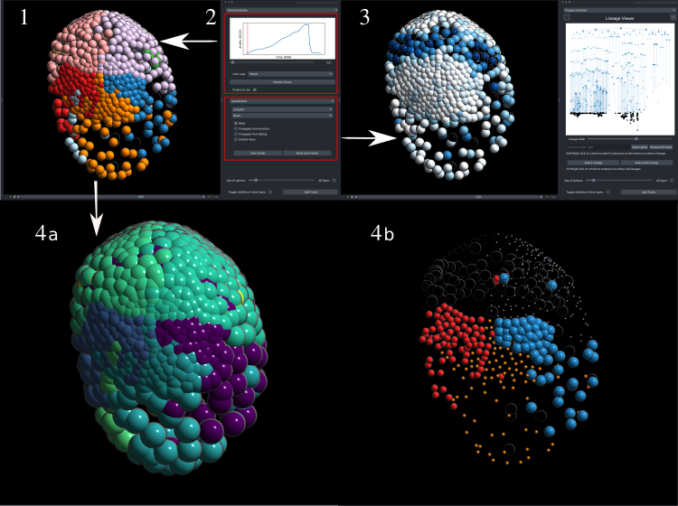

This component is mainly focused on showcasing different features and attributes of the embryo using the viewer.
There are 2 sections:

- One is for comparing different lineages between themselves, using the unordered tree edit distance algorithm
- The other is about showing other precomputed features on both the viewers and the lineage Viewer.

1. **The recolored clones**. This specific example was colored using the accent colormap at the timepoint, only 15 cells existed, while the dataset started from 8 cells.

- **Controlling the recoloring of the dataset**:

    - **Top** Using the slider, the user can select a timepoint on the population graph to serve as the reference (first timepoint) for all lineages. The starting cells may have divided into m cells by this time, resulting in m distinct sublineages. After choosing a colormap, the user may recolor the clones accordingly—this recoloring applies only to the napari viewer, creating the result of panel B.
    - **Bottom** The user can also select any precomputed feature from the imported LineageTree to color all nodes based on this feature. If certain nodes lack this feature, the user can choose to color them using one of the following options: 
        - Inherit the color from their ancestor
        - Leave them black. 
        - Use a default color

- **The results of this feature-based coloring** (2-bottom) are shown . This coloring affects both viewers simultaneously. This specific result is a *Parhyale hawaiensis* dataset colored by an attribute that has to do with cell-to-cell movement.
- **Qucik distance calculation**: Using Ctrl+Right Click the user can select any descendant of a clone to compare the subtree spawned by this clone to all others that start from timepoint n. The results of the comparisons may be projected on size a or on color b. In both examples, the lineage Elp has been clicked (magenta in a,blue in b ) and it is easily observable that the most similar clone is its symmetric one Erp (cyan in a, red in b).
