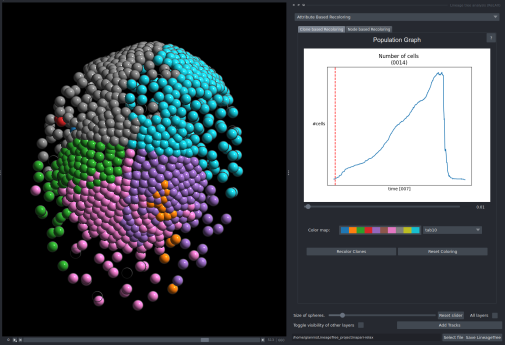
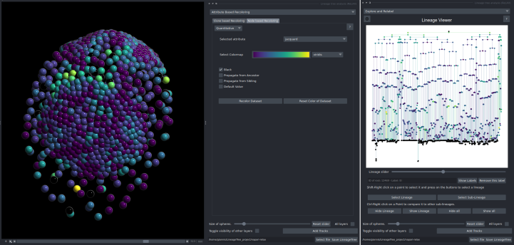

This component is mainly focused on showcasing quantitative and qualitative features of the dataset by recoloring the dataset or its lineages.
There are 2 sections:

- One is for recoloring any dataset according to the number of sublineages in a specific timepoint
- The other is about using precomputed features to recolor both viewers.

These two components are thoroughly discussed below:



- Using the slider, the user can select a timepoint where ```n``` clones exist. By pressing ```Recolor Clones``` each clone will be colored with a color specified in the colormap. In this specific example the image was recolored according to the clones that existed on timepoint 7.



- The user can select any quantitaive attribute and recolor it according to its value.***On the left*** the configuration screen and the colored viewer are shown. ***On the right*** one lineage on the lineage viewer, which is also recolored is shown. The important settings the user may manipulate are how to propagate the coloring. The options are:
    1. ***Black***: If a node has no value no color it will be shown in black color.
    - ***Propagate from Ancestor***: Each node with no value will inherit its value from its ancestor and colored the same color.
    - ***Propagate from Sibling***: Each node with no value will get the same valu as their sibling if they do have a color.
    - ***Default Value***: More settings are available here, as the user can select a value to color each node that has no color.
        1. ***Custom  Value***: The user can just input any value, so these nodes will get this value
        2. ***Mean***: Each node will be colored with just the mean value.
        3. ***Median***:  Each node will be colored with just the median value.
        4. ***Min***: Each node will be colored with just the mean value.