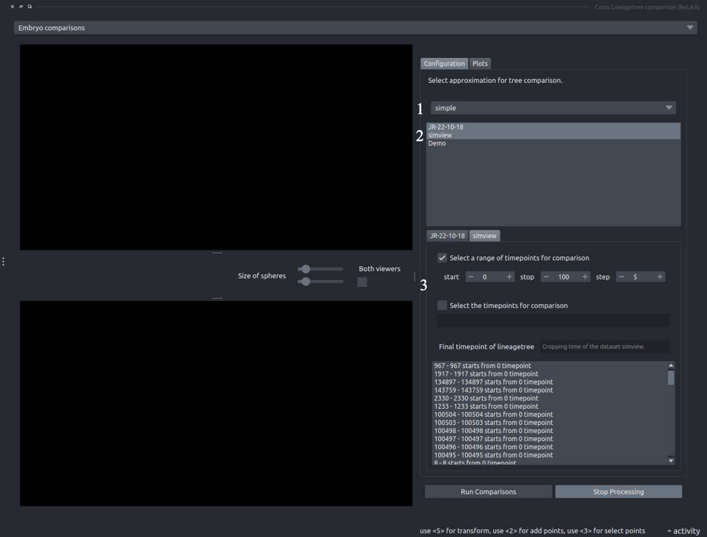
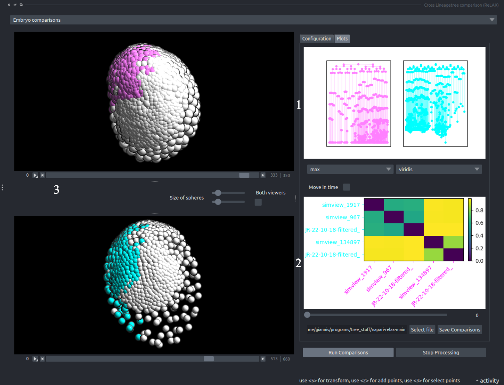

For comparisons across embryos the User Interface remains as close as possible to [Distance Calculation](../distance/distance.md). However some changes have been made to accomodate the needs of such an analysis.

1. **Tree approximation selection**: Similar to [Distance Calculation](../distance/distance.md), however any differences in time resolution are handled automatically by the manager.

- **Dataset Selection**: The user may select as many datasets from the manager as they want. Each selected dataset is added as a tab on 3
- **Configuring the roots**: This component is identical to [Distance Calculation](../distance/distance.md). An ***Important*** thing is that the user has to decide the levels of comparison and the crop times independently, so these comparisons need some prior rough analysis using the populations of cells of an embryo.

1. **Tree graphs**: The lineages that are currently being compared.

- **The cusltermap**: The clustermap that contains all the roots that are being compared and it's configuration/save buttons.
- **The 2 dummy viewers**: These viewers work independent to each other so the user may inspect different timepoints and different angles in each dataset. In this specific image the El lineage of 2 *Parhyale hawaiensis* embryos is being compared

The histogram has not been implemented yet for cross comparison, but it is in the works.