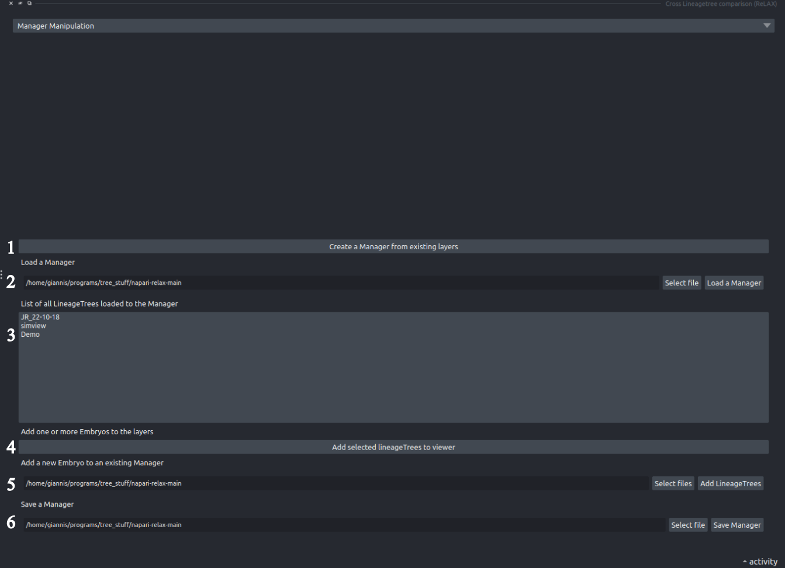

When comparing multiple datasets, users must account for various parameters, one of the most critical being temporal resolution. Recent advances in imaging and acquisition techniques have enabled significantly improved time resolution, leading to increased adoption of these modern tools. Consequently, integrating or comparing legacy datasets with newer, high-resolution data has become challenging. This component is designed specifically to address this issue by managing differences in temporal resolution, thereby allowing users to concentrate on the analysis and interpretation of the data rather than on preprocessing or alignment tasks.

1. **Create a Manager from existing layers**: Pressing this button will create a new manager that consists of all the layers of napari that contain a LineageTree.

- **Load an existing Manager**
- **The LineageTree list**: This list contains all the LineageTrees the curent manager contains. Users may interact with this list with right+Click to change the time resolutions of any dataset or remove it.
- **Add a LineageTree from the manager to the viewer**: Add a LineageTree from the manager to the viewer *if* it does not already exist in the layer list.
- **Add an embryo from file**: Imports an embryo from a file directly to the viewer.
- **Save the Manager**: Save the manager.
