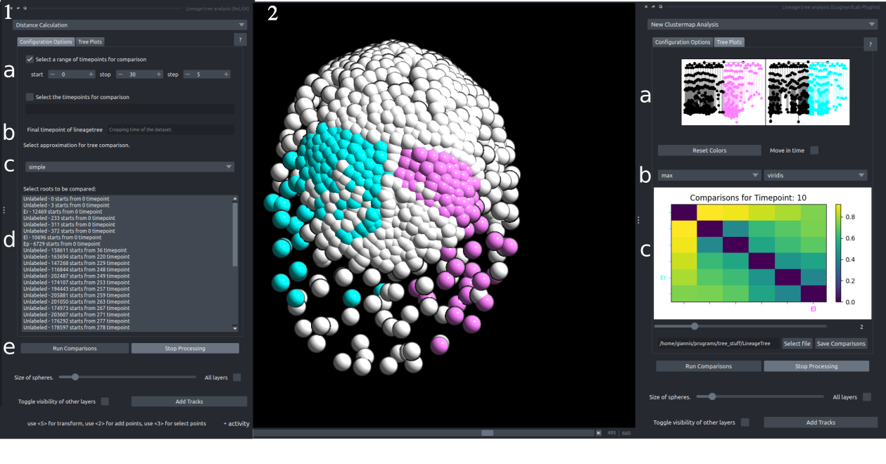

This component forms the core of the plugin. It enables users to calculate unordered tree edit distances online, using various pre-made approximation methods. Once the distances have been computed, users may choose to inspect and compare the lineages using both the napari viewer and the clustermap results. Some algorithms are very fast but not precise, while others are slow but much more precise.

1. Configuration Component
    1. **Levels of comparison selected**: For every lineage selected, their subtrees can also be compared to each other. Using that setting, thus the user may select the different levels at which the trees would be considered for comparison. For example, if there are 2 lineages that start on timepoint 0 and both have a division in a timepoint earlier than or on timepoint 5, then if the user selects to make a comparison at timepoint 5, there are going to be 4 lineages to be compared with each other. If the user preffers to put the timepoints manually using the button on the bottom.
    2. **Time crop**: Here, the user may set the last time point taken into account for the analysis.
    3. Approximation/Style selection: The user can select the appropriate approximation for their analysis. For more information on the analysis, see the LineageTree documentation.
    4. **Subtree selection**: The user may select the subtrees they want to compare. Some trees may start later in the dataset, due to tracking or imaging errors; however, they can still be selected and compared with subtrees that begin at the timepoint they exist.
    5. **Start/stop Comparisons**: The user can start the comparison, which will be run in a thread, meaning that the viewer will remain interactive during the calculations. At any point, the user may decide to stop the processing by clicking stop processing.
		
2. Analysis Component:
	1. The clustermap was produced by the systematic comparisons. There is a clustermap for each and every timepoint selected in 1 of the configuration components. This clustermap is normalized by 2. Interaction with the clustermap is done by using Left click on any element on the plot to create the tree graphs in 3, and recolor the selected embryo according to the compared sublineages
	2. Clustermap configuration: using the first combobox, the user may select their preferred way of normalization, according to the analysis they want to perform, the second is focused on providing different color gradients for recoloring the clustermap.
	3. Plots of the trees that are currently being interacted with through the clustermap, with their subtrees colored according to the colors of the viewer.
