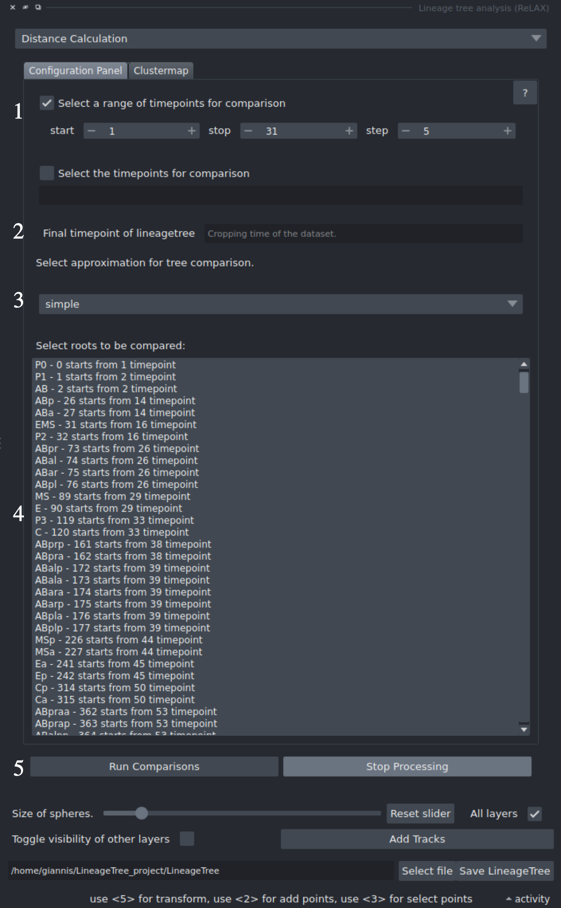
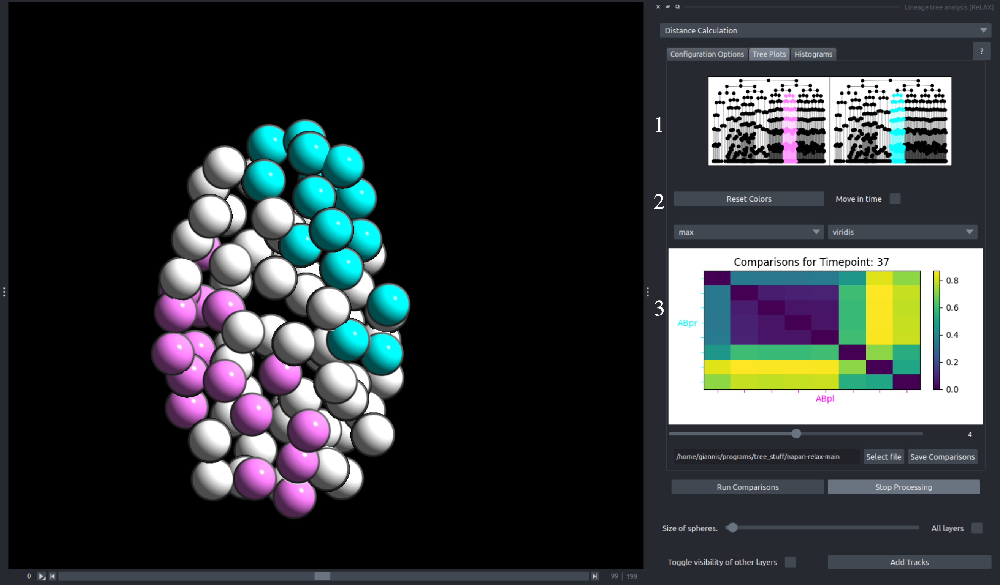

*Distance Calculation* focuses on systematic calculation of unordered tree edit distances of lineaeges and their sublineages across multiple timepoints, using various [approximation methods](https://guignardlab.github.io/LineageTree/uted/). 

This systematic comparison enables users to  calculate the pairwise distance of clones/sublineages that spawn from a specific timepoint, across multiple timepoints.

The results of these comparisons will be shown on a clustermap, which the user can download. However, a clustermap by itself is lacking in information, or at least is difficult to interpret the results in means of morphology, for this reason we allow for users to click on this clustermap to inspect which sublineages are being compared in each specific cell!

---

## Configuration Tab
<!-- 

{: style="height:500px;"}

1. **Timepoints Selection**: The user has 2 options to set the timepoints for the comparison:
    - **Top**: The user may set a range with steps
    - **Botom**: The user may set a list of specific timpeoints they want to compare.

- **Time crop**: The last timepoint to be included in the analysis, if the tree has nodes in later timepoints, they will be cut.
- [**Approximation/Style selection**](https://guignardlab.github.io/LineageTree/uted/#different-tree-approximations): The approximation to be used in the analysis. CAUTION: Different algorithms have different uses, for more information visit [LineageTree Tree approximatons](https://guignardlab.github.io/LineageTree/uted/#different-tree-approximations). Full tree is not recommended for large LineageTrees.
- **Subtree selection**: Specific lineages may be selected to calculate their pairwise distance. Some lineages may spawn later than the first timepoint selected due to tracking or imaging issues; they can still be included if they exist at the any if the selected timepoints.
- **Start/stop Comparisons**: The user can start calculating the comparisons. While the comparisons are being run the rest of the plugin and napari remain responsive. At any point, the user may decide to stop the processing by clicking `Stop Processing`. To check the progress of the comparison calculation a progress bar is also implemented. -->

  

    This Tab is responsible for setting up the systematic pairwise distance parameters.

<ol>
  <li>
    <strong>Timepoints Selection</strong>: The user has two options to set the timepoints for the comparison:
    <ul>
      <li><strong>Top</strong>: The user may set a range with steps.</li>
      <li><strong>Bottom</strong>: The user may set a list of specific timepoints they want to compare.</li>
    </ul>
  </li>

  <li>
    <strong>Time crop</strong>: The last timepoint to be included in the analysis. If the tree has nodes at later timepoints, they will be excluded (cut) from the analysis.
  </li>

  <li>
    <strong>Approximation / Style selection</strong>: The approximation to be used in the analysis. 
    <strong>CAUTION:</strong> Different algorithms have different uses. For more information, visit 
    <a href="https://guignardlab.github.io/LineageTree/uted/#different-tree-approximations" target="_blank" rel="noopener">
      LineageTree Tree approximations
    </a>. 
    The full tree mode is <em>not recommended</em> for large LineageTrees.
  </li>

  <li>
    <strong>Subtree selection</strong>: Specific lineages may be selected to calculate their pairwise distances. 
    Some lineages may spawn later than the first selected timepoint due to tracking or imaging issues; 
    they can still be included if they exist at any of the selected timepoints.
  </li>

  <li>
    <strong>Start / Stop Comparisons</strong>: The user can start calculating the comparisons. 
    While the comparisons are being processed, the rest of the plugin and Napari remain responsive. 
    At any point, the user may stop processing by clicking <code>Stop Processing</code>. 
    A progress bar indicates the calculation progress.
  </li>
</ol>

  

  

     
  

---
  
## Clustermap Tab

<!-- The comparisons that are being calculated are shown on a clustermap. This clustermap is interactive and allows user to click on it to inspect the morphology of the compared lineages.

1. **Tree plots**: Displays the trees that are currently being interacted with through the clustermap, with their subtrees colored according to the colors of the viewer.

- **Clustermap Configuration**: Using the left combobox, the user may select their preferred way of normalization, according to the analysis they want to perform, the right is focused on providing different color gradients for recoloring the clustermap.
- **Clustermap**: The clustermap was produced by the systematic comparisons. There is a clustermap for each and every timepoint selected in 1 of the configuration components. This clustermap is normalized by 2. Interaction with the clustermap is done by using Left click on any element on the plot to create the tree graphs in 3, and recolor the selected embryo according to the compared sublineages

 -->

  

    Using this component the user can calculate the unordered tree edit distance for any lineage or sublineage and the sublineages spawned by their ancestors. 

<ol>
  <li>
    <strong>Tree plots</strong>: Displays the trees that are currently being interacted with through the clustermap, 
    with their subtrees colored according to the colors of the viewer.
  </li>

  <li>
    <strong>Clustermap Configuration</strong>: Using the left combobox, the user may select their preferred 
    normalization method according to the analysis they wish to perform. The right combobox allows the user 
    to choose different color gradients for recoloring the clustermap.
  </li>

  <li>
    <strong>Clustermap</strong>: The clustermap is generated through systematic comparisons. 
    There is one clustermap for each timepoint selected in the configuration component. 
    This clustermap is normalized by <strong>2</strong>. 
    <ul>
    <li>Interaction is performed by 
    <strong>Left Click</strong> on any element in the plot, which creates the corresponding tree graphs 
    and recolors the selected embryo according to the compared sublineages.</li>
    </ul>
  </li>
  </ol>

  

  

     
  

---

Go to [Starting page](../index.md)                                           
Go to [Tutorials](../guides/guides.md)