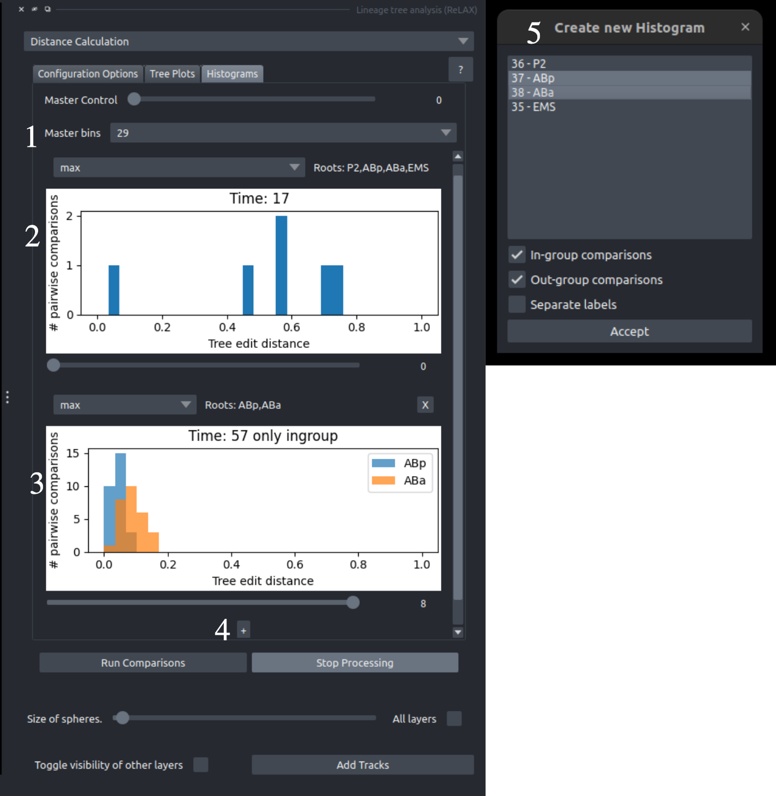

The *Distance Calculation* component enables users to calculate unordered tree edit distances, using various [approximation methods](https://guignardlab.github.io/LineageTree/uted/). Once the distances have been computed, users may choose to inspect and compare the lineages using both the napari viewer and the clustermap results. Some algorithms are very fast but not precise, while others are slow but much more precise.

This component focuses on calculating UTED systematically with different approximations and showcasing the results.

## Configuration

Using this component the user can calculate the unordered tree edit distance for any lineage or sublineage and the sublineages spawned by their ancestors.

{: style="height:500px;"}

1. **Levels of comparison selected**: For every selected lineage, their subtrees can also be compared. This setting allows users to specify subtrees rooted at a specific timepoint. The top section lets users choose a timepoint range, while the bottom section allows manual entry of specific timepoints. For example, if two lineages begin at timepoint 0 and both divide before or at timepoint 5, selecting comparisons at timepoint 5 results in four sublineages to be compared. The user may choose manual or a range of distances by using the corresponding checkboxes.

- **Time crop**: The last timepoint to be included in the analysis.
- [**Approximation/Style selection**](https://guignardlab.github.io/LineageTree/uted/#different-tree-approximations): The approximation to be used in the analysis. CAUTION: Different algorithms have different uses, for more information visit [LineageTree Tree approximatons](https://guignardlab.github.io/LineageTree/uted/#different-tree-approximations). Full tree is not recommended for napari uses.
- **Subtree selection**: Specific lineages may be selected to calculate their pairwise distance. Some lineages may spawn later than the first timepoint selected due to tracking or imaging issues; they can still be included if they exist at the any if the selected timepoints.
- **Start/stop Comparisons**: The user can start calculating the comparisons. While the comparisons are being run the rest of the plugin and napari remain responsive. At any point, the user may decide to stop the processing by clicking `Stop Processing`. To check the progress of the comparison calculation a progress bar is also implemented.

  
## Clustermap

The comparisons that are being calculated are shown on a clustermap. This clustermap is interactive and allows user to click on it to inspect the morphology of the compared lineages.

1. **Tree plots**: Displays the trees that are currently being interacted with through the clustermap, with their subtrees colored according to the colors of the viewer.

- **Clustermap Configuration**: Using the left combobox, the user may select their preferred way of normalization, according to the analysis they want to perform, the right is focused on providing different color gradients for recoloring the clustermap.
- **Clustermap**: The clustermap was produced by the systematic comparisons. There is a clustermap for each and every timepoint selected in 1 of the configuration components. This clustermap is normalized by 2. Interaction with the clustermap is done by using Left click on any element on the plot to create the tree graphs in 3, and recolor the selected embryo according to the compared sublineages
<!-- 
## Histograms

When analyzing multiple lineages, clustermaps can become large and difficult to interpret. This component allows users to generate and filter histograms to make the data more manageable.

{: style="height:500px;"}

1. **Master Controls**:
    - **Top**: The global slider that changes all histograms in sync.
    - **Bottom**: The bins controller is used to define the number of bins on the histograms. All the histograms will have the same number of bins as the master histogram (2.) even if it is set on `auto`.

- **Master Histogram**: The **Master Histogram** is generated immediately when comparison calculations begin. It aggregates all computed comparisons into a single, comprehensive graph. Any additional histograms created afterward are derived from this Master Histogram and represent subsets of its data. On the top left the user can change the normalization method. On the top right the roots used to produce it are visible and using the slider on the bottom the user can inspect the same sublineages across multiple times. In this example a C.elegans embryo is used and the analysis starts from the point that only 4 cells exist (P2, EMS, ABp, ABa).

- **Histogram spawned by the Master Histogram**: This histograms has the same controls apart from the `X` on the top right, which is used to delete the histogram. This specific histogram contains only ABp and ABa, 2 very similar lineages. Specifically, in this histogram there are no ABp-ABa comparisons, the only comparisons shown are between sublineages of ABp and between sublineages of ABa.

- **Add a new Histogram**: Pressing this button will spawn the pop-up window shown in 5.
- **Configure the new Histogram to be spawned**: Using this window the user can filter out the data, so that they may become interpretable. Any lineage can be selected and then may filter out the distances in-between or cross lineages. If `seperate labels` is not selected all comparisons will be shown as the same color, otherwise the will be one color for each comparisons as shown in (3.) -->
