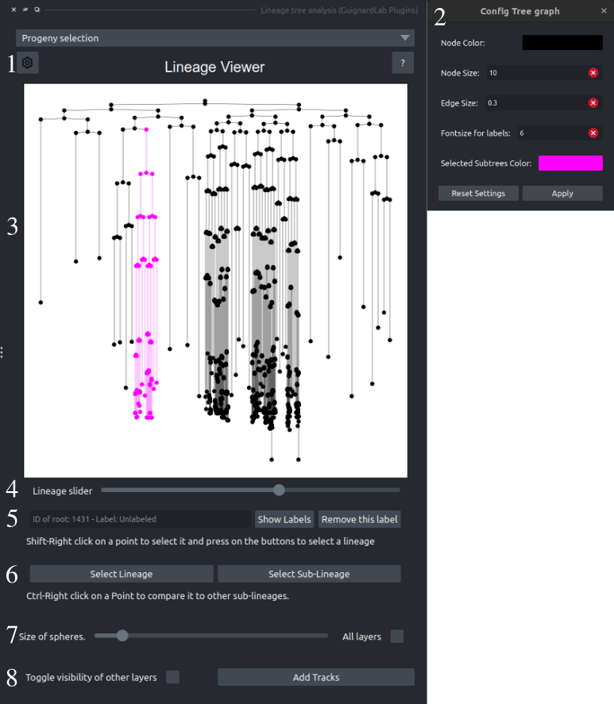
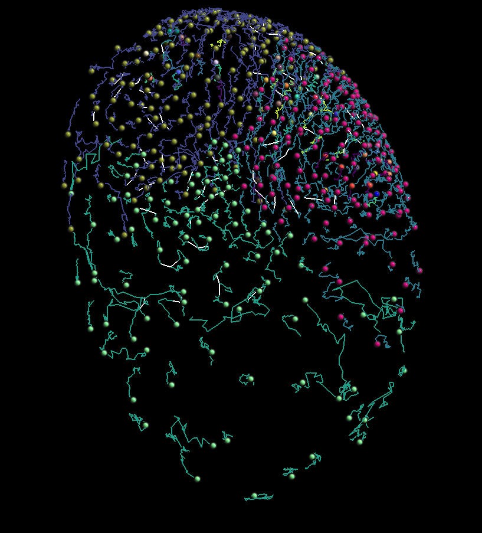

The core parts of this Exploration and Relabeling are:

- The interactive **Lineage Viewer** and its combination with the napari standard viewer
- **Relabel** any chain lineage or sublineage

This component contains features for navigating the lineages using both the Lineage Viewer and the Napari viewer and renaming lineages.

The Lineage Viewer is the plugin's first component, enabling lineage exploration, relabeling, and navigation through the viewer's time data.

1. **Lineage Viewer configuration button**: Press to open the configuration window

- **Lineage Viewer configuration window**: Using this window, the user may change the Lineage viewers: node size, node color, edge size, label fontsize, and the color of the selected cells.
- **The Lineage Viewer**: Using this viewer, the user may inspect all the lineages that exist in a dataset. It is zoomable and pannable; if zoomed in enough, the user may also see the label for each node. **Left + Clicking** on the viewer, the user can select the nodes of subtrees by clicking on the graph in both viewers. Also, when clicking, the user may use component 5 to change the label of any subtree.

    *Controls of the viewer:*

    - **Left click**: Using the left click, the user will select a subtree on the plot and the corresponding Points on the napari viewer.
    - **Mouse wheel**: Using the mouse wheel, the user can zoom in on the graph to observe specific details. If the user zooms in enough, the labels of each node will be shown on screen.
    - **Left click** and **drag**: Edge pan to see different segments of the lineage if the plot is zoomed in.
    - **Z**: Reset the view regardless of panning or zoom.

- **The Lineage Viewer slider**: Using this slider, the user may inspect different lineages that exist in the dataset
- **Label manipulation**: Change a label by entering a name, show all labels, or remove an existing label.
- **Select Lineage/Sublineage**: After the user has selected a point on the napari viewer, they may decide to select the whole lineage this node belongs to or the subtree by pressing the corresponding button. This will also update the plot. The user may also decide to change the colors of all nodes selected. Using panel 1 of. layer controls
- **Points Layer resizer**: Change the size of all the Points on a selected layer or all layers. The same value will be applied across all points modified.
- **General helping buttons**: 
    - **Left**: Toggle the visibility of other layers; this button may serve as a shortcut.
    - **Right**: Add a tracks layer to the Points layer for visualization purposes.

An example of a Tracks Layer:

