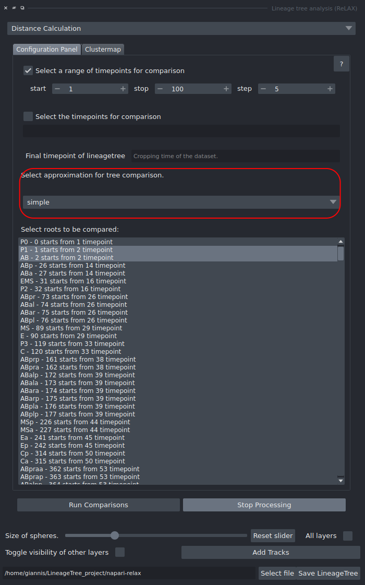
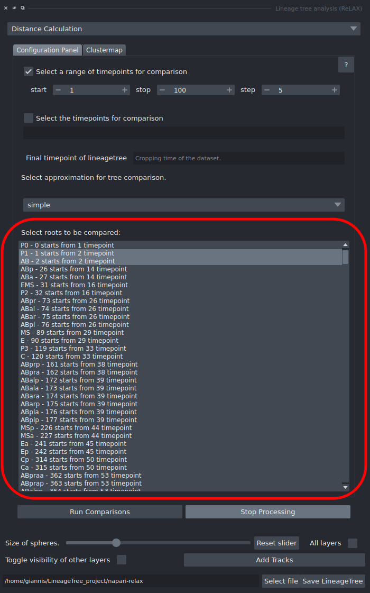
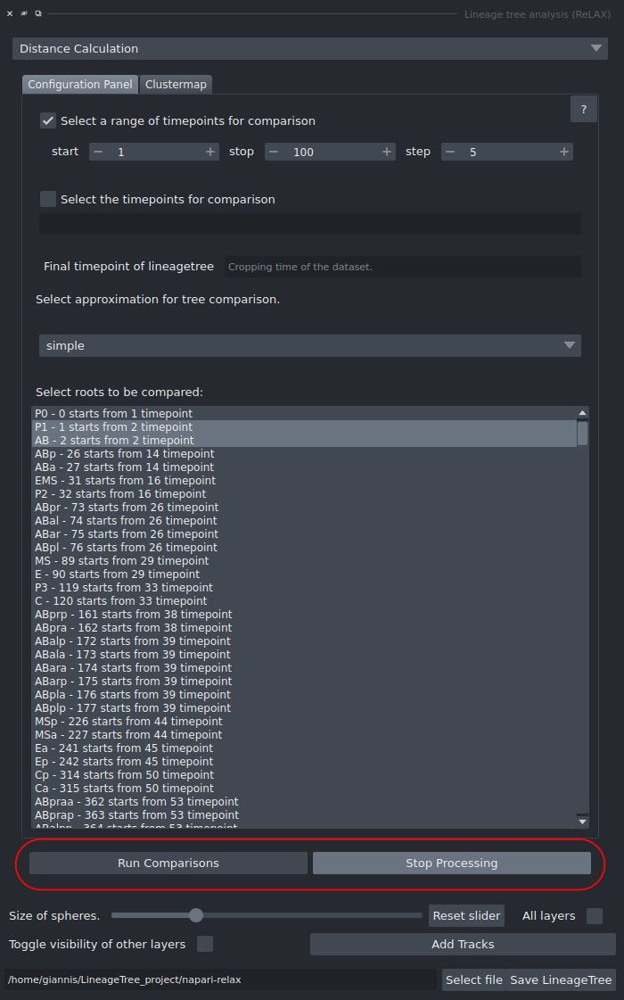
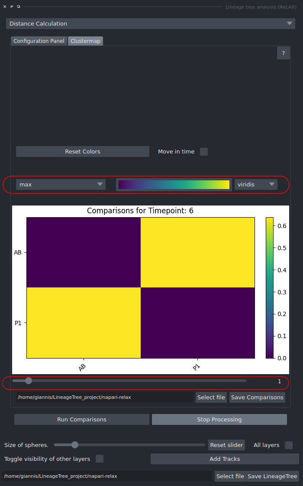
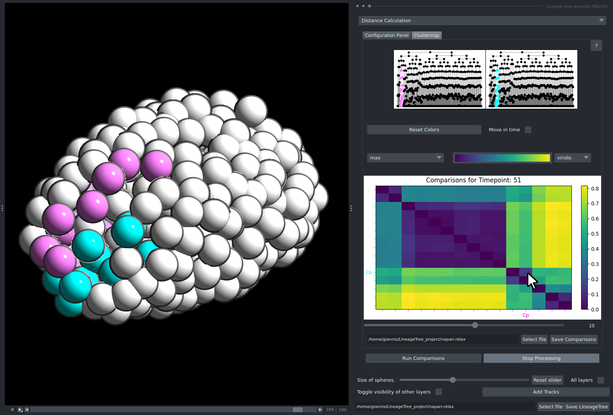

# Blind Comparison of Lineages

By calculating the distance between two lineages, users can identify which lineages or sublineages are similar or dissimilar. Manually selecting pairs for comparison can be tedious and time-consuming.  
This guide demonstrates how to **automatically compare every possible pair of lineages** to reveal clusters of similar lineages.

### 0. (Optional) Label the dataset:

The imported dataset may not contain predefined labels. However, adding labels can greatly enhance the interpretation and comparison of lineages. To learn how to assign and save labels, follow the instructions in [Relabelling and Saving Progress](../saving/saving_tut.md)

---

### 1. Select Timepoints

{ width="300" }

Define the range of timepoints from which sublineages will be analyzed.  
For a blind search, it is recommended to start from the beginning of the dataset and stop at a timepoint where cell divisions are still occurring.

---

### 2. Crop the Dataset

{ width="300" }

Lineages result from tracking, which depends heavily on data quality. In some cases, certain lineages are tracked more accurately than others.  
Because UTED is sensitive to differences in tree size, unequal tracking quality can lead to unreliable results.  
To minimize this, **crop the dataset** at a timepoint where most lineages of interest are still active and have not yet stopped dividing.

---

### 3. Select a Distance Style

{ width="300" }

Choose the method for distance calculation.  
For blind discovery of similar lineages, the **full tree is highly not recommended**.

---

### 4. Select Roots

{ width="300" }

If you wish to compare sublineages from specific roots, select those roots by left-clicking on them. Only labelled lineages are listed.  
To include all listed roots in the analysis, select one root and press **Ctrl + A** to highlight them all. If no root is selected, all lineages that start at the first timepoint selected are compared.

---

### 5. Run the Comparison

{ width="300" }

Start the process by clicking **Run Comparisons**.  
The tool will calculate distances between all possible lineage pairs within the selected parameters.

---

### 6. Inspect the Results

{ width="300" }

Examine the resulting clustermap to identify potential clusters of similar lineages. Hover over a cell to see which lineages it compares and their score.  
Experiment with different colormaps and normalization settings to highlight meaningful patterns and refine the results.

---

### 7. Explore the Clustermap

{ width="600" }

Click on an interesting cell in the clustermap (at any timepoint) to view how the corresponding sublineages contribute to the overall morphology.  
Repeat this step as many times as needed to explore different relationships.

---

### 8. (Optional) Save the Comparisons

{ width="600" }

Save any interesting comparison results as a `.pkl` file with **Select file** and **Save Comparisons**, for further analysis using external data analysis tools or libraries. The comparisons are also kept in the LineageTree, so [saving the dataset](../saving/saving_tut.md) keeps them too.
