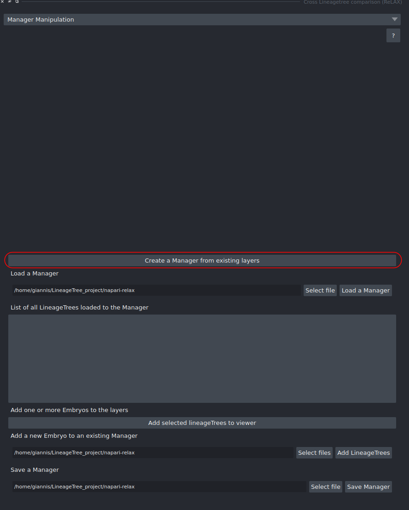
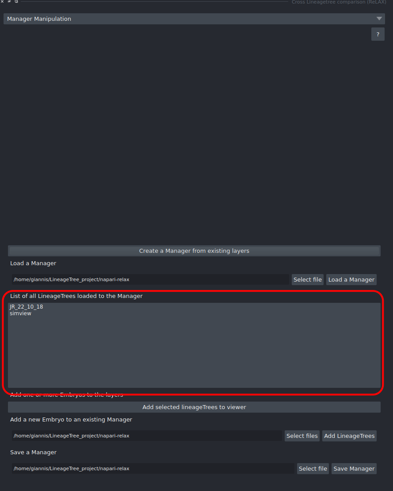
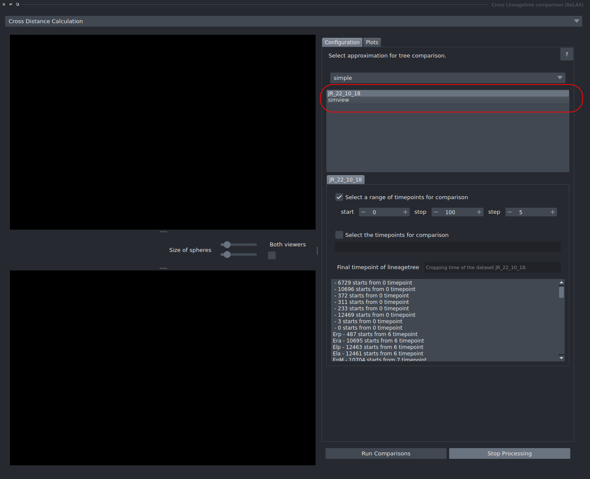
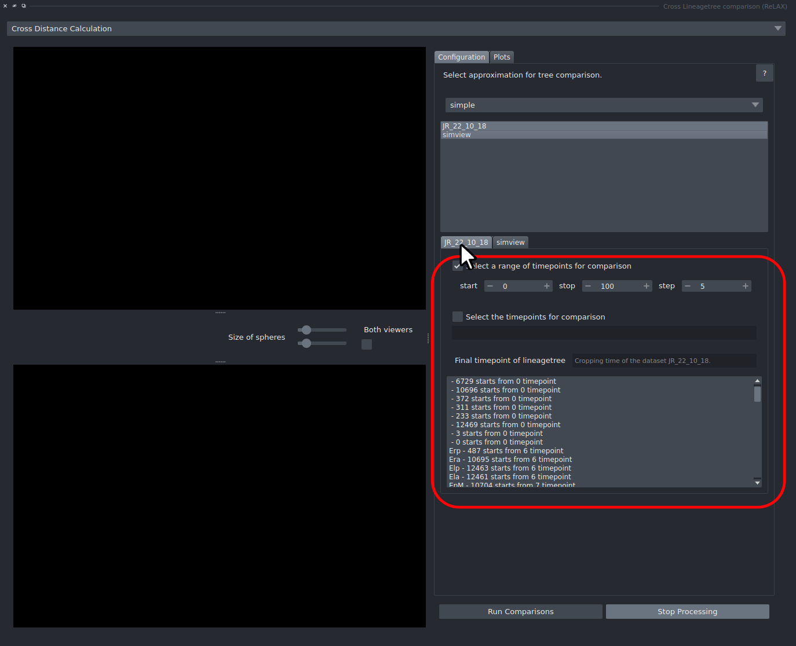
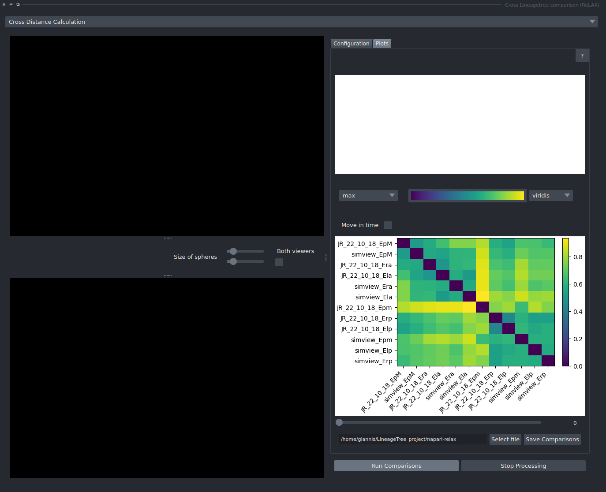
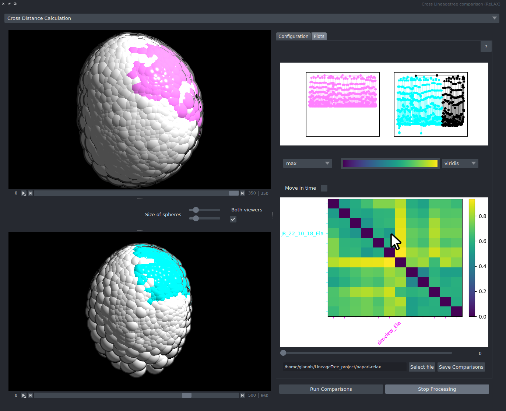

# Cross-Dataset Lineage Comparison

Comparing lineages within a single embryo can provide valuable insights into the developmental patterns of that organism.  
However, even more knowledge can be gained by comparing lineages **across different specimens or species**.  
This tutorial demonstrates how to perform **blind lineage comparisons between organisms**, using prior knowledge to extract meaningful biological relationships.

---

### 0. (Optional) Label the Dataset

The imported dataset may not contain predefined labels.  
However, adding labels can greatly enhance the interpretation and comparison of lineages.  
To learn how to assign and save labels, follow the instructions in [**Relabelling and Saving Progress**](../saving/saving_tut.md).

---

### 1. Create a Manager

{ width="300" }

First, create a **Manager** to handle the processes required for cross-dataset comparison.  
To quickly create a manager from the loaded datasets, click **Create a Manager from existing layers** in **Manager Manipulation**.

---

### 2. (Optional) Check the Time Resolution

{ width="300" }

Time resolution is an important parameter when comparing datasets.  
By **right-clicking** on any dataset in the manager list and choosing **Change Time Resolution**, you can modify its time resolution.  
This ensures that time-dependent events are properly aligned between datasets.

---

### 3. Select the Datasets to Compare

{ width="700" }

Open **Cross Distance Calculation** and select the datasets to be compared by clicking on each preferred dataset in the list.

---

### 4. Configure the Comparison Parameters

{ width="700" }

Configure the comparison parameters for each dataset individually, following the same procedure described in [**Blindly Comparing Lineages**](../comparing/blind_comparing.md).  

Each dataset must be configured independently to ensure accurate distance measurements.  
For example, it was possible to compare two *Parhyale hawaiensis* embryos — one starting with 8 cells and another with 19 cells.  
The choice of starting timepoints depends on the dataset:  
some can be aligned easily using their population graphs, while others may require advanced techniques such as **dynamic time warping**.
**Again, using full tree for comparison is highly not recommended**

---

### 5. Run the Comparisons

Once configuration is complete, press **Run Comparisons** to begin the analysis.

---

### 6. Inspect the Clustermap

{ width="700" }

The user interface is nearly identical to that of [**Blindly Comparing Lineages**](../comparing/blind_comparing.md),  
with the addition of two dataset viewers on the left side.  
In the clustermap, each dataset name is clearly displayed for easier cross-reference, and hovering over a cell shows the compared lineages and their score.

---

### 7. Analyze the Results

{ width="700" }

Interpreting similarities and differences across datasets can be more challenging than when comparing a single embryo’s lineages.  
Clusters will usually include **self-to-self** lineages, while the comaprisons across embryos may not be in the center of the clusters.  
To gain deeper insights, it is recommended to explore multiple cells in the clustermap and examine their contributions.

---

### 8. (Optional) Save the Comparisons

If the results are satisfactory, save the comparisons as a `.pkl` file with **Select file** and **Save Comparisons**, for future reference or further analysis using external tools and libraries.
