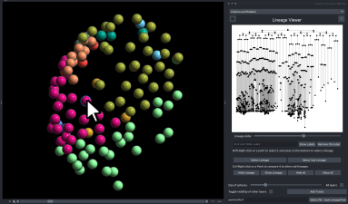
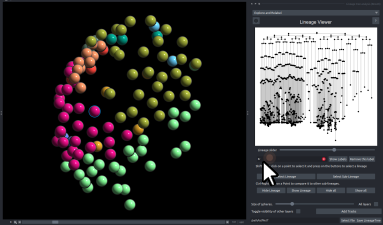
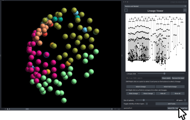

## Saving Progress in LineageTree

LineageTree files can be modified using the plugin.  
Users who have manually assigned labels to a LineageTree or performed extensive pairwise distance calculations may wish to preserve their progress to avoid data loss.  

This section describes the procedure for saving progress after such modifications.

---

### 1. Selecting a Node

To modify a specific node, perform **Shift + Right Click** on a point within the viewer,  
or select the desired node directly from the **Lineage Viewer** panel.

---

### 2. Editing Labels

Enter the appropriate label in the **Label Editor**.  
If pairwise comparisons have been executed, the results are automatically saved within the LineageTree file, as detailed in the [Pairwise Distance Tutorial](./comparing/comparison.md).

---

### 3. Saving the LineageTree

Specify the desired file path and save the updated LineageTree.  