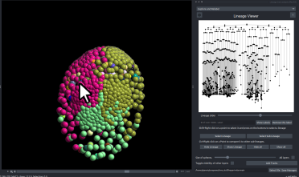
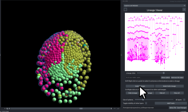
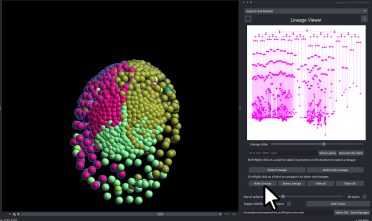
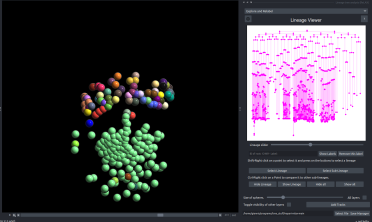
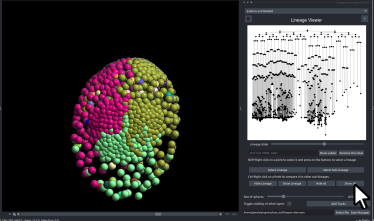

## Managing Lineage Visibility in 3D Datasets

Some three-dimensional (3D) datasets may contain multiple tissue layers, where one lineage obscures another and prevents clear visualization.  
To address this, users can **temporarily hide selected lineages** to reveal structures that are otherwise difficult to inspect.  

In the following example, a *Parhyale hawaiensis* embryo has developed multiple tissue layers that overlap and hinder detailed examination.

---

### 1. Identifying Obstructing Lineages

In this example, the lime and red lineages obscure the underlying layer.  
Begin by selecting any node belonging to the lineage that is obstructing the area of interest.

---

### 2. Selecting the Lineage

Once a node is selected, click **Select Lineage** to highlight the entire lineage.

---

### 3. Hiding the Lineage

Click **Hide Lineage** to conceal the selected lineage.  
Repeat this process for all additional lineages that need to be hidden.

---

### 4. Inspecting Inner Layers

After all obstructing lineages have been hidden, the inner layers become clearly visible and can be examined in detail.

---

### 5. Restoring All Lineages

Once the inspection is complete, click **Show All Lineages** to restore visibility to all previously hidden lineages.
