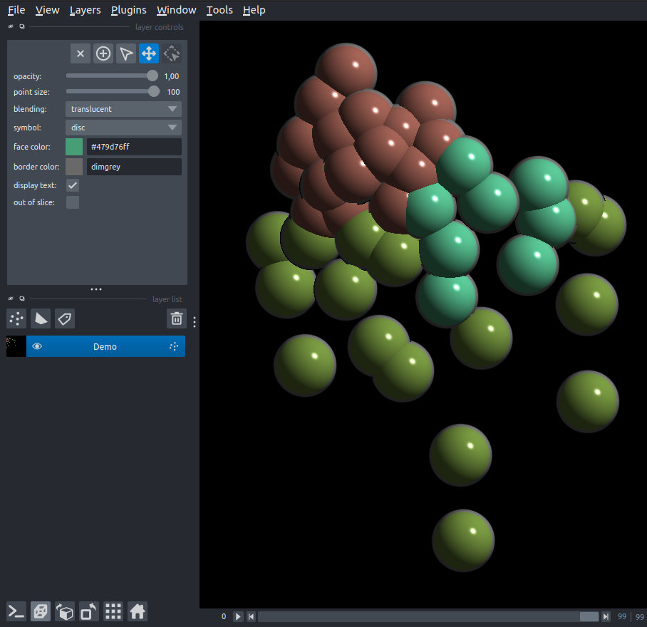

## Installation

You can install `napari-relax` via [pip]:

```
pip install napari-relax
```

If napari is not already installed, you can install `napari-relax` with napari and Qt via:

```
pip install "napari-relax[all]"
```

To install latest development version :

```
pip install git+https://github.com/guignardlab/napari-relax.git
```

## Import a  dataset into the viewer

To import a new dataset can ***drag and drop*** any [supported format](https://guignardlab.github.io/LineageTree/loaders/), like *TGMM*, *MaMuT, Mastodon or ASTEC* and *.lT files*, into napari or select it with the open file pop up window into the Viewer.

There are also 2 demo datasets easily accessible from ***File>Open Sample>demo LineageTree dataset***.
Other datasets will also be available in [citation].

- The first demo dataset contains 3 descendants of Er lineage of *Parhyale hawaiensis* across the first 100 timepoints of their development.
- While the other contains a C. elegans embryo starting from P0 with multiple geneexpressions (from other datasets) imported.
[positional data](), [gene expression data]()



---

Go to [Starting page](./index.md)                                           
Go to [Tutorials](./guides/guides.md)
