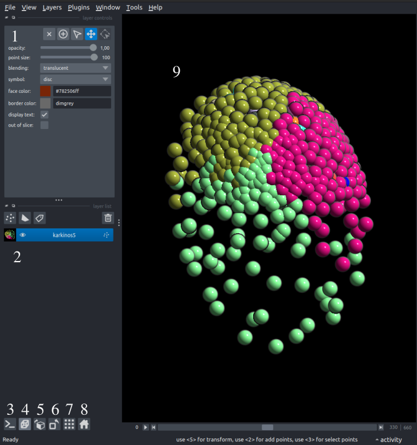

<p style="text-align: justify;">

The <a href="https://napari.org/stable/tutorials/fundamentals/quick_start.html#napari-quick-start" target="_blank">Napari viewer</a>  is a crucial part of this plugin, as it is used throughout the whole plugin. Using the viewer, multiple specimens may be loaded simultaneously. These datasets may be rotated, zoomed in or out, recolored, rescaled, among other things, thoroughly described in the napari documentation.
</p>

<p style="text-align: justify;">

Usually, the datasets loaded overlap with each other, so it's recommended to use the grid mode <b>(Ctrl+G)</b> to remove overlapping or hide all the other layers. The user may manually turn on/off the visibility of layers or use alt+left click on the layer of interest to hide every other layer.
</p>

For this plugin the [Points Layer] (https://napari.org/stable/howtos/layers/points.html) is mainly used.



## Napari Viewer controls panel: 

1. **Layer Controls**: This component is responsible for changing the colors of different layers and handles how the overlapping looks (blending). For different types of layers, this component changes. Regarding this plugin, it mostly uses Points layers.

- **Layer list**: The layer list is responsible for adding, removing, selecting, and changing the visibility of layers.
- **Napari Terminal**: Turn the Napari integrated terminal on or off. This terminal can prove extremely useful for small modifications of the dataset (rotation, translation, scaling), and can also be used as a Jupyter notebook with the correct configuration.
Sample code to manipulate the dataset:

    ```python
    for i in range(len(viewer.layers[0].data)):
        viewer.layers[0].data[i] = viewer.layers[0].data[i] + np.random.uniform(0,100)
    viewer.layers[0].refresh()
    ```

-  **3-D viewer**: Toggle 3-D view, essential for navigating 3-D/4D datasets **(Ctrl+Y)**.
- **Visible axis controls**: Change the order of visible axes (not very useful in the context of the plugin)
- **Transpose the dataset**.
- **Grid view**: The grid view is only important if multiple specimens are shown in the same viewer and they should not overlap **(Ctrl+G)**.
- **Reset Viewer**: Reset the viewer to the starting position (does not revert changes made through the integrated terminal) **(Ctrl+R)**.
- **Napari Viewer**: The datasets imported will be shown on this viewer, and its visualization and navigation capailities are harnessed throughout the whole plugin. Some **important buttons**:
    - Drag Left Click: Rotate the dataset.
    - Shift Left Click: Move the dataset
    - Scroll: Zoom in and out
    - **Shift Right Click**: Select a node. The selected node can be used by the progeny selection module.

    At the bottom of the viewer sliders are visible to scroll through the speciment in time and space.
