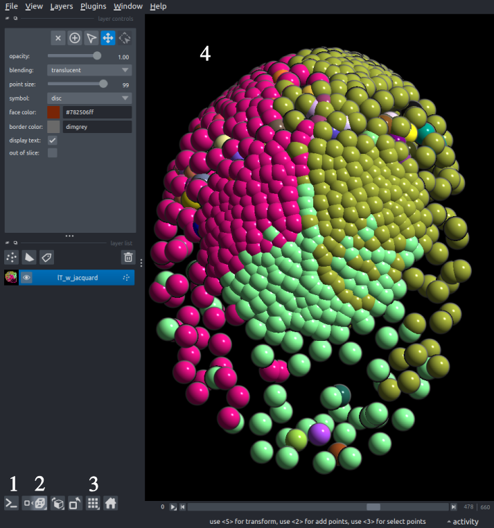

The <a href="https://napari.org/stable/tutorials/fundamentals/quick_start.html#napari-quick-start" target="_blank">Napari standard viewer</a>  is a crucial part of this plugin, as it is used throughout the whole plugin. Using the viewer, **multiple datasets** may be loaded simultaneously. These datasets may be rotated, zoomed in or out, recolored, rescaled, among other things, thoroughly described in the napari documentation.

Usually, the datasets loaded overlap with each other, so it's recommended to use the grid mode <b>(Ctrl+G)</b> to remove overlapping or hide all the other layers. The user may manually turn on/off the visibility of layers or use alt+left click on the layer of interest to hide every other layer.

For this plugin the [Points Layer] (https://napari.org/stable/howtos/layers/points.html) is mainly used.

## Important Napari Viewer controls panel:

1. **Napari Terminal**: Turn the Napari integrated terminal on or off. This terminal can prove extremely useful for small modifications of the dataset (rotation, translation, scaling), and can also be used as a Jupyter notebook with the correct configuration.
Sample code to manipulate the dataset:

- **3-D viewer**: Toggle 3-D view, essential for navigating 3-D/4D datasets **(Ctrl+Y)**.
- **Grid view**: The grid view is only important if multiple specimens are shown in the same viewer and they should not overlap **(Ctrl+G)**.
- **Napari Viewer**: The datasets imported will be shown on this viewer, and its visualization and navigation capailities are harnessed throughout the whole plugin. Some **important buttons**:
    - Drag Left Click: Rotate the dataset.
    - Shift Left Click: Move the dataset
    - Scroll: Zoom in and out
    - **Shift Right Click**: Select one node. When a node is selected the Lineage Viewer will also show the correspnding lineage on the [Lineage Viewer](../explore_relabel/explore_relabel.md). 

Using the time slider on the Napari Viewer will also show the corresponding timepoint on the viewer. 
